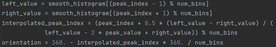
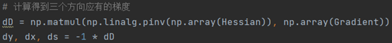
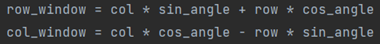
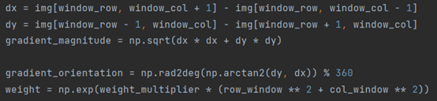
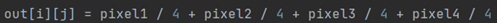

# SIFT 特征检测  

# 一、引言  

SIFT 特征检测算法（Scale Invariant Feature Transform，尺度不变特征变换匹配算法）可以用于图像关键特征点的捕获和不同角度、光影拍摄条件下的图像的识别和目标检测。  

实验要求从底层复现SIFT 算法，实现两张图片之间的关键点检测和关键点匹配，从而实现目标检测的目的。  

实验目的是：  

1. 深入理解SIFT 算法的每个数学原理，如高斯滤波，泰勒展开，海森矩阵等等  
2. 了解SIFT 算法每个参数的含义以及最优值，如高斯滤波方差σ等  
3. 手动实现图像下采样和卷积，生成高斯金字塔和高斯差分金字塔  
4. 了解并实现尺度空间极值检测，关键点精确定位，主方向分配，特征描述这些过程  
5. 了解SIFT 算法的下游任务，实现关键点匹配这一任务  

# 二、相关工作  

SIFT（Scale Invariant Feature Transform，尺度不变特征变换匹配算法）是由 David G. Lowe 教授在 1999 年（《Object Recognition from Local Scale-Invariant Features》）提出的高效区域检测算法，在 2004 年的《DistinctiveImage Features from Scale-Invariant Keypoints》得以完善。该算法在 1999年申请了专利，其专利属于英属哥伦比亚大学。SIFT 专利在2020 年3 月17 日之后到期。  

SIFT 算法可以在 open-cv 库中调用 $c v 2 . S I F T _ { c r e a t e } ( )$ 来实现，但是我决定根据模型的原理手动实现，在关键的实现过程中，仅仅采用 numpy 库，而不使用其他额外的库来辅助。  

# 三、方法介绍  

从基础原理的角度介绍所采用的方法。  

关键点匹配任务分为三个步骤：特征提取、特征描述和特征匹配。SIFT 算法实现了前两个步骤，特征提取和特征描述。将图像特征的提取和描述的问题  

转化为寻找图像关键点（keypoints）和建立基于关键点的图像特征描述子（feature descriptor） 的问题。  

1. 建立高斯金字塔和差分金字塔。不同Octave 的图像经过不同程度的降采样。同一Octave 的不同列的图像经过的高斯滤波方差值不同。  

2. 建立尺度空间，检测图像极值点。通过高斯微分函数建立尺度空间，通过高斯差分尺度空间（DoG scale-space）检测图像局部极值点。  

3. 去除不稳定点，确定关键点。不稳定点主要为不稳定的边缘点和低对比度的关键点，Dacid G.Lowe 通过拟合二阶微分方程的方法排除低对比度点，同时可采用Harris 角点检测方法去除不稳定的边缘点。  

4. 确定关键点的方向。主要原理是统计关键点领域所有的梯度方向直方图，以直方图中最大值作为该关键点的主方向，同时为了提高后续匹配的鲁棒性，将直方图中峰值超过主峰 $8 0 \%$ 的方向作为该关键点的辅方向。  

5. 关键点描述。在每个关键点周围的邻域内，在选定的尺度上测量图像局部的梯度。这些梯度被变换成一种表示，这种表示允许比较大的局部形状的变形和光照变化。  

6. 关键点匹配。将源图像中的关键点与目标图像中的关键点进行匹配，从而完成局部特征检测和特征匹配的任务。  

# 3.1 建立高斯差分金字塔  

# 高斯金字塔生成  

首先明确参数：组数(Octave)，每一组有几层(Intvrval)尺寸相同，但模糊系数 $\scriptstyle { \left( \sigma \right) }$ 不同的采样图像组成。  

每组的Intvrval 自行指定，设为S，通常为6 由于生成差分金字塔的过程中，层数会损失一层，在寻找空间极值的时候，最上和最下层无法参与计算，又会损失两层，所以设最终可用层数为 $\mathsf { n }$ ，则有：  

$$
S { = } n { + } 3
$$

组数(Octave) 的计算方式如下，其中 M、N 为原始图像的行和列数  

$$
O { \mathop { \bf = } } [ \log _ { 2 } m i n { \left( \cal M , N \right) } ] { - } t , t \in [ 0 , \log _ { 2 } { \left\{ m i n { \left( \cal M , N \right) } \right\} } ]
$$

每一个 Octave 有 6 个 Intvrval,尺寸相同但模糊系数 $\sigma$ 不同的采用图像组成，令o 为组索引序号，r 为层索引序号，s 为高斯差分金字塔每组层数，O 为金字塔组数， $\sigma _ { 0 }$ 为高斯模糊初始值，其变化公式为：  

$$
\sigma \big ( o , r \big ) = { \sigma _ { 0 } } 2 ^ { o + \frac { r } { s } } o \in \big [ 0 , . . . , O - 1 \big ] , r \in \big [ 0 , . . . , s + 2 \big ]
$$

在本实验中，得出的σ列表如下  

高斯模糊的方式就是使用高斯核对图像在x 和y 方向上进行卷积，高斯核的  

生成与 $\sigma$ 有关，以 $3 \times 3$ 高斯核为例，相对坐标如下： 

 

则高斯核对应像素点的取值的计算方式为：  
$$
H _ { i , j } = \frac { 1 } { 2 \pi \sigma ^ { 2 } } e ^ { \frac { - \left( i - k - 1 \right) ^ { 2 } + \left( j - k - 1 \right) ^ { 2 } } { 2 \sigma ^ { 2 } } }
$$

不同组的分辨率不同，下一组Octave $( \mathsf { i } + 1 )$ 由上一组Octave(i)下采样产生，同一组由第一层的图像经过高斯核卷积形成。不过为了保持高斯差分金字塔的尺度空间的连续性，下一个Octave $( \mathsf { i } { + } 1 )$ 的第 1 层由上一个 Octave(i)中倒数第 3  

层直接降采样不需高斯核卷积产生。而同一组中索引号 1 至5 的图像则是在本组的第 1 层基础上使用连续的可模糊产生的，不需要降采样。  

# 差分金字塔(DoG)生成  

高斯差分图像金字塔（DOG）就是将图像金字塔每一层的图片（6 张不同模糊程度，相同尺寸）进行差分运算。每一组的第一幅图片与第二幅图片进行差运算、第二幅与第三幅进行查运算。以此类推，逐组逐层生成每一个差分图像，所有差分图像构成差分金字塔。  

  

# 3.2 空间极值检测  

空间极值检测分为粗略检测和精细检测两步。  

# 粗略检测  

由于特征点一定由DOG 空间的局部极值点组成，所以粗略筛选中，要先寻找极值点。为了寻找DOG 函数的极值点，每一个像素点要和它所有的相邻点比较，看是否比它的图像域和尺度域的相邻点大或者小，就可以寻找极值点。  

  

将每一组的几张图片叠在一起，作为一整个三维的矩阵图像。矩阵图像的每一个像素写作 $D [ x , y , \sigma ]$ ，原来的每一层，现在充当了一种channels通道的角色。中间的检测点和26 个相邻点比较：中间图像中有 8 个相邻像素，下邻图中有 9 个相邻像素，上邻图中有 9 个相邻像素。  

# 精细检测  

粗略检测到的极值点是离散空间的极值点，而实际上可以将DoG空间看作一个连续的空间，这样能够提高特征检测和关键点匹配的准确性和稳定性。为了能够精确地确定关键点的位置和尺度，得到真正的极值点，需要进行曲线拟合，将离散的点变成连续的曲面，可以使用泰勒公式进行曲线拟合。  

$$
f \left( x \right) \approx f \left( 0 \right) + f ^ { ^ { \prime } } \left( 0 \right) x + \frac { f ^ { ^ { \prime \prime } } \left( 0 \right) } 2 x ^ { 2 }
$$

由于离散值没有导数，所以需要进行离散值的近似拟合。通过导数的定义，  

可以将点的左右邻点的斜率当作一阶导数，左右邻点减去中间点的两倍当作二  

阶导数，如下面的公式所示：  

$$
\begin{array} { c } { { \frac { \partial f } { \partial x } = \frac { f \left( i , j + 1 \right) - f \left( i , j - 1 \right) } { 2 h } , \frac { \partial f } { \partial y } = \frac { f \left( i + 1 , j \right) - f \left( i - 1 , j \right) } { 2 h } } } \\ { { \frac { \partial ^ { 2 } f } { \partial x ^ { 2 } } = \frac { f \left( i , j + 1 \right) - f \left( i , j - 1 \right) - 2 f \left( i , j \right) } { h ^ { 2 } } , \frac { \partial ^ { 2 } f } { \partial y ^ { 2 } } = \frac { f \left( i + 1 , j \right) - f \left( i - 1 , j \right) - 2 f \left( i , j \right) } { h ^ { 2 } } } } \\ { { \frac { \partial ^ { 2 } f } { \partial x \partial y } = \frac { f \left( i - 1 , j - 1 \right) + f \left( i + 1 , j + 1 \right) - f \left( i - 1 , j + 1 \right) - f \left( i + 1 , j - 1 \right) } { 4 h ^ { 2 } } } } \end{array}
$$

在极值点 $X _ { 0 } { = } ( x _ { 0 } , y _ { 0 } , \sigma _ { 0 } )$ 处，通过上述的近似公式和二阶泰勒展开式可知，  

邻域内的其他点 $X$ 有：  

$$
{ \cal D } \big ( { \cal X } \big ) = { \cal D } + \frac { \partial { \cal D } ^ { T } } { \partial X } X + \frac { 1 } { 2 } X ^ { T } \frac { \partial ^ { 2 } { \cal D } } { \partial X ^ { 2 } } X
$$

其中， $\mathsf { D }$ 为 $D \big [ x , y , \sigma \big ]$ ，也即原始值大小， $X = \left( { \boldsymbol { x } } , { \boldsymbol { y } } , { \boldsymbol { \sigma } } \right)$ 是点在尺度空间的位  

置坐标，而两个导数分别为：  

$$
\scriptstyle { \frac { \partial D ^ { T } } { \partial X } } = \left[ { \frac { \partial D } { x } } { \frac { \partial D } { y } } { \frac { \partial D } { \sigma } } \right]
$$

$$
\begin{array} { r l } { \frac { \partial ^ { 2 } D } { \partial x ^ { 2 } } } & { { } \frac { \partial ^ { 2 } D } { \partial x \partial y } } & { { } \frac { \partial ^ { 2 } D } { \partial x \partial \sigma } } \\ { \frac { \partial ^ { 2 } D } { \partial X ^ { 2 } } = [ \frac { \partial ^ { 2 } D } { \partial y \partial x } } & { { } \frac { \partial ^ { 2 } D } { \partial y ^ { 2 } } } & { { } \frac { \partial ^ { 2 } D } { \partial y \partial \sigma } ] } \\ { \frac { \partial ^ { 2 } D } { \partial \sigma \partial x } } & { { } \frac { \partial ^ { 2 } D } { \partial \sigma \partial y } } & { { } \frac { \partial ^ { 2 } D } { \partial \sigma ^ { 2 } } } \end{array}
$$

对方程求导，并让导数为0，可以解得预估的极值点的位置为：  

$$
\stackrel { \stackrel { \stackrel { \cdot } { } } { } } { X } = \stackrel { \stackrel { \cdot } { [ } x , y , \stackrel { \cdot } { \sigma } ] } { X } = \stackrel { - \hat { \sigma } ^ { 2 } D ^ { - 1 } } { \hat { \sigma } X ^ { 2 } } { \frac { \partial D } { \partial X } }
$$

¿ 代表相对插值中心的偏移量，因为在实际计算中，是在尺度空间计算的，  

以粗筛的关键点作为原点。当它在任一维度上的偏移量大于0.5 时，意味着插值中心已经偏移到它的邻近点上，所以必须改变当前关键点的位置。  

由此可以解得精确极值点的位置。在代码实现中，尺度空间即包含着极值点的 $3 \times 3 \times 3$ 的邻域三维矩阵。  

# 3.3 去除边界特征点  

DoG 算法会产生较强的边缘响应，这是因为高斯差分算子的极值在横跨边缘的地方有较大的主曲率，而在垂直边缘的方向有较小的主曲率。因此，检测  

出主曲率较大的点，即可将其去除。  

主曲率可以通过一个 $2 \times 2$ 的Hessian矩阵 $H$ 求出，因为 $D$ 的主曲率和 $H$ 的特征  

值 $r = \alpha / \beta ( \alpha$ 是较大的特征值， $\beta$ 是较小的特征值)成正比。首先，生成Hessian矩  

阵，可以通过上一步精细检测的泰勒展开式中的二阶导数 $3 \times 3$ 矩阵 $\frac { \partial ^ { 2 } D } { \partial \boldsymbol { X } ^ { 2 } }$ 切片得  

到：  

$$
H = \bigl [ \begin{array} { l l } { D _ { x x } } & { D _ { x y } } \\ { D _ { x y } } & { D _ { y y } } \end{array} \bigr ]
$$

但是可以不必直接求解 $H$ 的特征值，可以通过构造的方式来达到目的，根据线性代数的知识，可以得知：  

Hessian 矩阵的迹：Tr (H )=D +D =α+β Hessia n矩阵的行列式：Det ⁡( H )=Dxx D yy−( Dxy )2=αβ  

将迹的平方除以行列式，可以得到：  

$$
\frac { T r \left( H \right) ^ { 2 } } { D e t \left( H \right) } = \frac { \left( \alpha + \beta \right) ^ { 2 } } { \alpha \beta } = \frac { \left( r \beta + \beta \right) ^ { 2 } } { r \beta ^ { 2 } } = \frac { \left( r + 1 \right) ^ { 2 } } { r }
$$

从而构造出了 $\frac { ( r + 1 ) ^ { 2 } } { r }$ 当 $r { > } 1$ 时，为递增的。所以边缘检测只需要检测 $r < r _ { 0 } ,$ 而论文建议 ${ { r } _ { 0 } } \mathrm { { = } } 1 0$ ，因此，在实现中只需进行如下判断即可：  

$$
\frac { T r \left( H \right) ^ { 2 } } { D e t \left( H \right) } { < } \frac { \left( r _ { 0 } + 1 \right) ^ { 2 } } { r _ { 0 } }
$$

# 3.4 特征点的主方向分配  

在实际的SIFT 算法应用中，需要检测出不同角度拍摄下的同一物体，因此描述符必须具有旋转不变性。为了使描述符具有旋转不变性，需要利用图像的局部特征为给每一个关键点分配一个基准方向。  

关键点主方向分配就是基于图像局部的梯度方向，分配给每个关键点位置一个或多个方向。首先，方向的计算方式是，求解像素点与周围点的梯度的方向和大小 $\setminus _ { \circ }$ 。L 为关键点所在的尺度空间值，对每一个 $\cdot \sigma$ 有 $L ( x , y + 1 ) { = } D [ x , y , \sigma ] _ { \circ }$  

梯度的方向：  

$$
\theta ( x , y ) = \tan ^ { - 1 } { I } \frac { L ( x , y + 1 ) - L ( x , y - 1 ) } { L ( x + 1 , y ) - L ( x - 1 , y ) } I
$$

梯度的大小：  

$$
m \left( x , y \right) = \sqrt { \left( L \left( x + 1 , y \right) - L \left( x - 1 , y \right) \right) ^ { 2 } + \left( L \left( x , y + 1 \right) - L \left( x , y - 1 \right) \right) ^ { 2 } }
$$

其次，要选定一个局部的窗口大小，因为关键点自身的方向可能会出现偏  

差，所以必须要统计一定的窗口内的像素点的方向。对于在 DoG 金字塔中检测  

  

出的关键点，采集其所在高斯金字塔图像 $3 \sigma$ 邻域窗口内的像素的梯度模值和方向的分布特征。如下图所示：  

其中，窗口大小 $\boldsymbol { \cdot } 3 \sigma$ 中的 $\sigma$ 通过公式 $\sigma = 1 . 5 \times \sigma _ { o c t }$ 进行加成， $\sigma _ { o c t }$ 指的是在这一组中，第一层在进行高斯滤波时所使用的 $\sigma$ 值。  

然后，在完成关键点的梯度计算后，使用直方图统计领域内像素的梯度和方向。梯度直方图将0 360度的方向范围分为36 个柱，其中每柱10 度。  

对梯度直方图进行平滑处理，增强鲁棒性，使用公式：  

$$
H ( i ) = \frac { h \bigl ( i - 2 \bigr ) + h \bigl ( i + 2 \bigr ) } { 1 6 } + \frac { 4 \times \bigl ( h \bigl ( i - 1 \bigr ) + h \bigl ( i + 1 \bigr ) \bigr ) } { 1 6 } + \frac { 6 \times h \bigl ( i \bigr ) } { 1 6 }
$$

方向直方图的峰值则代表了该特征点处邻域梯度的方向，以直方图中最大值作为该关键点的主方向。为了增强匹配的鲁棒性，只保留峰值大于主方向峰值 $8 0 \%$ 的方向作为该关键点的辅方向。  

找到了主方向和辅方向之后，与寻找关键点相似，也需要精确寻找极值，所以使用二次函数插值，最终拟合出真实的方向。  

# 3.5 生成关键点描述符  

图像局部特征检测要求关键点具有尺度不变性和方向不变性，而在关键点  

匹配中一般采用的比较方法是向量距离比较法，比如欧氏距离、曼哈顿距离，以此来衡量关键点的相似性，因此需要为每个关键点建立描述符。  

对于每一个关键点，在前面步骤的计算中可以得到三个信息：关键点位置、关键点尺度以及关键点主方向。而 SIFT 描述符是关键点邻域高斯图像梯度统计结果的一种表示。通过对关键点周围图像区域分块，计算块内梯度直方图，生成具有独特性的向量，这个向量是该区域图像信息的一种抽象，具有唯一性。Lowe 教授在论文中建议,在关键点尺度空间内 $4 \times 4$ 的窗口中,计算8个方向的梯度信息，将这些信息，使用共 $4 \times 4 \times 8 = 1 2 8$ 维的向量进行表征。  

首先需要确定窗口的边长。令窗口边长 $d { = } 4$ ,共有 $4 \times 4$ 个子区域，每个子区域的大小与关键点方向分配时相同，也即 $3 \sigma$ 邻域， $\sigma = 1 . 5 \times \sigma _ { o c t }$ ，考虑到旋转因素，插值因素等等，分别需要边长 $d { + } 1$ 以及乘以 ${ \sqrt { 2 } } / 2$ ，最终确定窗口边长：  

$$
r a d i u s { = } \frac { 3 \sigma _ { o c t } \times \sqrt { 2 } \times \left( d + 1 \right) } { 2 }
$$

其次需要进行旋转变换，下面式子中的 $\theta$ 是计算出的关键点的主方向，所以  实际上这一步操作是要把邻域内的其他点旋转至关键点的主方向，以关键点的  

主方向作为0度方向：  

$$
( \stackrel { \cdot } { \underset { y } { x } } ^ { \prime } ) = ( \stackrel { \cos \theta } { \sin \theta } - \sin \theta ) ( \stackrel { x } { \underset { y } { x } } )
$$

然后，将邻域内的采样点分配到对应的子区域内，并且将子区域内的梯度值分配到8 个方向上，计算其权值。旋转到了对应区域后，需要求解位置：  

$$
\left( \boldsymbol { x } ^ { \prime \prime } \right) { = } \frac { 1 } { 3 { \sigma } _ { o c t } } { \left( \boldsymbol { x } ^ { \prime } \right) } { + } \frac { d } { 2 }
$$

接着，为每个像素的梯度模值加权重，子区域的像素的梯度大小按 $\sigma { = } d / 2$ 的高斯加权计算：  

$$
w = m \left( a + x , b + y \right) * e ^ { \frac { - \left( x ^ { ' } \right) ^ { 2 } + \left( y ^ { ' } \right) ^ { 2 } } { 2 \times \left( 0 . 5 \right) ^ { 2 } } }
$$

其中， $m \left( a + x , b + y \right)$ 可以根据上面梯度模值的计算方式获得，右边的部分是进行了高斯加权计算。  

计算每个点在子区域中对种子点的贡献，最终累加在每个方向上的梯度大小为：    

$$
\begin{array} { r } { w e i g h t { = } \dot { z } g r a d \big ( I _ { \sigma } \big ( x , y \big ) \big ) \vee { \times } e ^ { \frac { - x _ { k } ^ { 2 } + y _ { k } ^ { 2 } } { 2 \sigma _ { \vee } } } \times \big ( 1 - d _ { r } \big ) \times \big ( 1 - d _ { c } \big ) \times \big ( 1 - d _ { o } \big ) } \end{array}
$$

将 $4 \times 4 \times 8 = 1 2 8$ 个计算结果合并为向量，即为该关键点的特征向量，接下来再进行归一化即可。  

# 四、实验  

# 4.1 代码架构  

代码采用了手动实现的方式来复现SIFT 算法。  

代 码 共 分 为 5 个 文 件 ，match开头的py文件是主文件

- gaussian_pyramid.py   
- image_process.py   
- keypoint_descriptors.py   
- match_self.py   
- match_with_cv2.py  

**代码功能**  

- gaussian_pyramid.py实现高斯金字塔的建立和差分金字塔求解。
- keypoint_descriptors.py 实现关键点检测和描述符生成  
- image_process.py用于实现一些需要调用 cv2 才能实现的功能
- match_self.py利用上面的函数实现局部特征匹配
- match_with_cv2.py用于对照，调用 open-cv 实现 SIFT 算法 

**代码调用库的情况**  

将代码分成多个文件一是方便随时测试，二是可以证明在关键步骤未使用open-cv 库。除了match_with_cv2.py是使用了 open-cv 库直接进行 SIFT 检测之外，只有image process. py使用了 open-cv 库和 matplotlib 库，进行图片读取和展示。实现 SIFT 算法的关键步骤代码gaussian_pyramid.py和 keypoint descriptors.py中 ， 均 只import 了 numpy 库。  

# 代码策略  

写代码的过程采用了边写边测的方式，由于暂时还没有将jupyter 应用到本地的pycharm 中，所以为了节省时间，方便 debug，将每一步的计算结果都使用pickle 库存储到了txt 文件中，方便下一步load 调用。  

  

实验在 pycharm 平台使用 python3.9+numpy 来实现。    

数据使用了前苏联歌手维克多·崔的照片作为图片

将截图旋转作为待检测图片。  

# 4.2 实验困难点  

4.2.1gaussianpyramid . py部分  

# 4.2.1.1 高斯金字塔实验原理理解有误  

在开始的时候并不理解SIFT 算法的原理，只是看了网上的一些讲解，不巧的是，一开始看的讲解并没有提到高斯金字塔构建的关键细节，也即组数和层数的确定。一开始都是自己定的组数。后来才知道组数的计算方法，以及 n,S  的含义  

sigma的确定一开始也不懂得细节，只是自己定了一个列表后来才知道计算方法，进行了修改  

# 4.2.1.2 差分金字塔  

差分金字塔的计算中容易出现的问题是越界，一开始我计算完成后的图像展示出来之后，并不能展示图像的原本样子，因为两图相减之后越界，所以要限定像素取值到(0,255)范围：  

# 4.2.1.3 错误实现了三色的差分金字塔  

一开始我以为这个任务基于上次的任务，所以生成了三色的金字塔，而且在实现的过程中很费力，如下代码花费了很长的时间来实现padding。

  然而了解到下一步是在尺度空间内进行之后，就了解了应当使用灰度图像，这样padding 反而简单 

这一步的 padding 是为了防止在图片下采样的过程中越界，我采用的pooling 方式是取均值，所以进行了 edge 方式的 padding  

# 4.2.2keypoint descriptors.py部分  

# 4.2.2.1 参数理解  

一开始并不理解实验中用到的各种参数的含义，看懂这些参数花费了很多的时间，我把这些参数的含义都注释在了代码上，这是精细确定关键点的函数  

  

这是获得主方向的函数  

# 4.2.2.2 尺度空间理解  

一开始并不理解尺度空间，误以为泰勒展开是在整个图像上进行，后来才明白泰勒展开和关键点微调都是在邻域进行的，以下是计算海森矩阵和梯度的函数

  

# 4.2.2.3 边缘效应消除理解  

在做的过程中复习了线性代数，了解了这里的数学原理，写在了前面的原理部分，而且在这里np.det 无法使用，所以手动实现了求解行列式  

# 4.2.2.4 关键点各个所需参数计算  

关键点需要记录关键点的坐标，关键点的层数，关键点的组数，关键点的大小，后续还会计算关键点的方向  

# 4.2.2.5 主方向分配的原理理解  

主方向分配的参数需要许多的计算公式，我一开始并不清楚每个公式的作用，所以在网络上进行了大量学习之后得知了半径的各个参数的含义  

这是计算梯度和方向的循环：  

这是平滑，平滑和最后的拟合不同 

这是拟合的过程，用于寻找精确的方向

# 4.2.2.6 关键点解码方式  

关键点储存的信息需要解码至正常信息才可理解，对于每一个参数需要进行如下的操作  

# 4.2.2.7 关键点精细调整计算结果  

代表相对插值中心的偏移量，当它在任一维度上的偏移量大于0.5 时，意味着插值中心已经偏移到它的邻近点上，所以必须改变当前关键点的位置。同时在新的位置上反复插值直到收敛；也有可能超出所设定的迭代次数或者超出图像边界的范围，此时这样的点应该删除，在Lowe 中进行了5 次迭代。另外，过小的点易受噪声的干扰而变得不稳定，所以将小于某个经验值(Lowe 论文中使用0.03，rmislam 实现时使用0.04/S)的极值点删除。同时，在此过程中获取特征点的精确位置(原位置加上拟合的偏移量)以及尺度  

# 4.2.2.7 描述符原理理解  

描述符的含义是在关键点尺度空间内 $4 { \times } 4$ 的窗口中,计算8 个方向的梯度信息，将这些信息，使用共 $4 \times 4 \times 8 = 1 2 8$ 维的向量进行表征。  

窗口和子窗口中，子窗口才是对应的上面的主方向分配的窗口。  

接下来的代码按照原理进行执行

要建立四个列表用来储存方向信息和梯度信息

首先是方向旋转，按照二维旋转公式进行：  

另外需要注意的是，一般的循环中使用 $\cdot , \cdot$ 容易混淆行列和横纵， $\mathsf { x }$ 是 col,y  是 row  

接下来是计算调整之后的角度：  

然后根据公式来计算绝对的坐标

然后计算梯度模值和方向之后，计算权重

计算方式是：  

最后需要计算每个点在子区域中对种子点的贡献，最终累加在每个方向上的梯度大小，需要大量的重复公式，代码很长，中间写错了很多次，需要注意下标和细节。  

关键点和描述符的计算过程如下，调用了上面所说的函数  

由于这些代码需要运行很长的时间，所以我在逐个写上面的每隔函数的过程中，对其进行了逐步保存的操作，方便下次调用。  

# 4.2.3 其他  

# 4.2.3.1 filename 变量  

在载入图像的过程中出现了这种错误，  

这些图像载入我专门写在了image process. py，这是专门用来实现一些调用cv2 库的方法  

Python 中，str 和filename 是两种变量，体现在如果设定一个 str 变量来写内容的话，并不会自动填充同一文件夹的文件名，而 filename 却会自动填充文件名，解决方式却很奇怪：  

调用时加入输入变量名后解决  

# 4.2.3.2 numpy 越界  

在计算过程中出现了多次这种numpy 的runtimeout 错误，这是因为计算过程中出现了超越了(0,255)的结果，所以不应该相加再除以 4，而是除以4 再相加  

# 4.3 实验结果    

生成的高斯金字塔如下：  

图中不同的行（即不同的Octave）表示图像经过不同程度的降采样（即缩小比例）。同一行的不同列表示图像经过的高斯滤波方差值不同（同一行从左至右方差依次增大）。  

差分金字塔：  

  

手动实现的关键点检测如下：  

 
这是调用了open-cv 实现的sift 关键点匹配  

在手动实现关键点时，为了方便观察关键点的匹配情况，我对照片进行了旋转处理，使其方向相同。同时，我也实现了彩色图片的匹配和显示。  

但是，我手动实现的效果差于open-cv 自带的方法，关键点检出的比较少，而且这些点在人眼看来并不关键，不如open-cv 自带的方法，甚至能够检测出眼睛、嘴等等的五官，这是人脸识别的关键信息。  

可能是因为我对于sift 算法的原理理解得还不够深刻，出现了问题，尤其是关键点的检测和描述符的生成，虽然按照公式进行了实现，但是还是感觉不能够将这些东西内化于心，真正的学懂底层的原理。  

另外可能是因为python 是一种高级的语言，不如c 语言能够实现更多底层的操作，而且我的代码也需要进一步的优化。  

总之，虽然能够实现sift 特征匹配，但是实现的效果还有待改进。  

# 五、总结  

通过这次的实验我有了很多的收获。  

首先我理解了SIFT 算法的原理。在这个SIFT 算法中，实际上有着许多的步骤。逐步地实现描述符生成这一任务。其实这个任务不妨倒着看，由于想要角度和尺度不变性，所以需要描述符，而图像中一定存在一些关键的点，所以描述符应当由关键点来组成。关键点如何来寻找呢？关键点一定是信息丰富的点，而局部的特征可以用梯度来表示，所以需要有差分金字塔，通过差分金字塔的极值来寻找关键点。描述符的不变性要求进行关键点的主方向寻找和邻域方向的定位。而其他的泰勒展开、插值等等的数学工具则主要是用来优化的。  

其次我理解了计算机视觉工程的关键点。计算机视觉中参数显得尤为重要，在原理部分就充斥着参数大小的考量，并不像之前所学到的算法，不论参数如何，总归可以实现一些目的，而计算机视觉的算法，参数如果选择不当，实现的效果就会差很多，在算法实现的过程中，就需要很小心各个参数如何定义。参数的理解也是我在学习这个算法过程中最头疼的一点了。  

再次我锻炼了自己的代码能力。在这个实验中，许多的任务实现都有着一些巧妙的办法，不用进行底层的操作，而是可以使用 numpy 对矩阵进行操作。我一开始想到的方案都比较的笨，而在网上搜索实现某个小任务时，总能够看到一些巧妙地实现，从而受益匪浅。另外在这个实验中，我采用了类似于jupyter 的编写方式，将代码尽量分开，边写边输出测试，代码的架构也比较的清晰。  

最后，我学习到了计算机视觉处理中的关键技巧。在SIFT 算法中，离散和连续总是相辅相成，虽然图像是离散的，但是可以构成连续的空间，虽然仅仅是数十或数百边长的矩阵，却可以容纳许多的数学原理在其中，我原本认为离散的任务就会比较的粗糙，而在这个算法中却也为了关键点的一些精细调整而动用了海森矩阵、二阶泰勒展开等数学公式，也让我对数学工具的应用有了更深的理解。  

我认为这个算法的内涵丰富而不复杂，很适合我来入门计算机视觉，我也学到了很多知识。  
